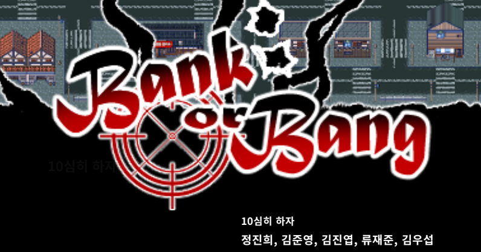
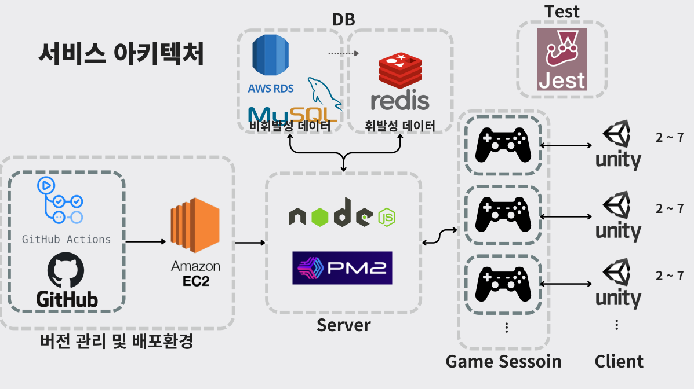
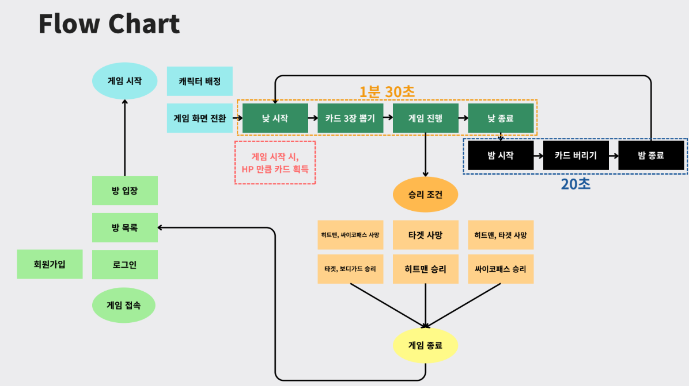

# bang_game



## 개요

보드게임 뱅을 모티브로, 마피아 게임의 심리전을 결합한 실시간 전략 게임
최소 2인 최대 7인이서 즐길 수 있다.

플레이어는 타겟, 킬러, 보디가드, 싸이코패스 중 하나의 역할을 맡게 되며, 각 캐릭터마다 고유한 능력이
부여된다.

낮에는 맵을 돌아다니며 다른 플레이어들과 상호작용을 하고, 밤에는 체력에 따라 카드를 관리하거나 전
략을 재정비한다.

협력과 배신이 교차하는 페이즈 속에서, 역할에 맞는 각자의 승리 조건을 달성하는 것이 게임의 목표이
다.

## 기술 스택

- Node.js
- MySQL
- AWS RDS
- Redis
- PM2
- Jest
- GitHub & GitHub Action

## 시연 영상

https://youtu.be/rIvyEi3BnkI?si=y8bwkG4PtdBW6T3N

## 서비스 아키텍처



## Flow Chart



#### 낮

- 게임 시작 시, HP 만큼 카드 획득
  - 카드는 셔플 후, 차례대로 분배
- Phase 1 마다 카드 2장씩 획득 → 유저가 사망할때마다 아침에 뽑는카드 증가
- 맵을 돌아다니며, 다른 플레이어들과 상호작용 가능
  - 카드를 사용해 다른 플레이어를 제거하고, 승리 조건 달성

#### 밤

- 자신의 현재 체력에 따라, 보유한 카드를 처리
  - 제한 시간 내에 처리하지 않을 시, 자동으로 체력 만큼 카드 처리 진행

## 프로젝트 실행

1. 의존성 설치

```
npm install
```

2. 실행

```
npm run start
```

## 주요 콘텐츠

- 카드 사용
  - 유틸, 무기, 장비, 디버프
  - 애니메이션
- 상대방 카드 흡수/제거
  - 핸드 카드/장착 무기or장비/디버프
- 페이즈 순환
  - 낮: 카드 드로우 및 카드 사용
  - 밤: HP 만큼 카드 버리기
- 음성 채팅
- 이동 부스터
- BGM
  - 낮과 밤, 그리고 다양한 카드 효과

## 트러블 슈팅

### 1. 데이터 처리 중, 패킷으로 인한 요청 처리 지연/실패 문제

#### 문제 상황

1. 배포 서버에서 테스트 결과, 일부 요청이 제대로
   수행되지 않는 현상 발견
2. 디버깅 결과, 클라이언트에서 전송된 데이터가
   2배씩 들어오는 걸 확인

#### 원인

- TCP 스트림의 특성으로 인한 데이터 병합 -클라이언트가 연속적으로 데이터를 보낼 때, 서버에서는 데이터가 병합되거나 중복된 형태로 수신
  - 이로 인해, onData()에서 중복된 데이터를 동일하게 처리하려다 문제 발생
- 중복 패킷 처리 미흡
  - 중복된 데이터가 들어오더라도 이를 무시하거나 제거하지 못하고, 동일한 데이터를 반복 처리하려고 함
- 불완전한 데이터 처리 부족
  - 잔여 데이터가 완전한 패킷을 구성하지 못할 경우, 이에 대한 검증 로직이 부족

#### 해결 과정

- 중복 패킷 감지 및 무시
  - validateSequence()에서 시퀀스를 검증하고, 중복된 패킷인 경우 상태와 메시지를 반환
  - onData() 에서 중복 패킷은 페이로드 길이를 읽고, 해당 데이터를 버퍼에서 제거
  - 이후 continue를 사용해 다음 패킷을 진행
- 잔여 데이터 검증 로직 추가
  - socket.buffer에 잔여 데이터가 있을 경우, 이 데이터가 유효한 패킷의 일부인지 확인
  - 불완전한 데이터는 삭제하지 않고, 새로운 데이터를 기다려 병합 후 처리

### 2. 데이터 처리 중, 패킷으로 인한 요청 처리 지연/실패 문제(1)

#### 문제 상황

1. A유저가 B유저에게 BANG을 사용 => 대치 상황 발생
2. 이때, 다른 유저가 카드를 사용
3. B유저에게 BANG이 누적되는 문제 발생

#### 원인

- 카드를 사용할 때마다 userUpdateNotification()을 사용
  - 해당 함수는 유저의 정보가 변할 시, 자신을 포함한 다른 유저에게도 해당 사실을 알리는 역할
- 즉, 이미 상태가 BBANG_TARGET 인 B유저는 userUpdateNotification()로 인해 다시 한번 자신의 상태가 BBANG_TARGET 라는 걸 받게 됨
  - 이로 인해 BANG을 비롯한 다른 카드들도 누적되는 걸 확인

#### 해결 과정

- 상태가 None이 아닌 유저를 제외하고 유저 정보를 업데이트

### 3. 데이터 처리 중, 패킷으로 인한 요청 처리 지연/실패 문제(2)

#### 문제 상황

1. 상태를 바꾸고 userUpdateNotification()를 사용하여 이를 알려주는데,
2. 상태가 None이 아닌 유저들은 제외해버려 바뀐 상태를 클라이언트에게 전달 불가
3. 이로 인해, 다음과 같은 논리가 필요

#### 해결 과정

- 새로운 updateNotification() 함수 제작
  - 상태 변경 시에만, 해당 유저에게 알림을 전송
- userUpdateNotification()와 별도로 작동하여 중복 문제와 누락 문제를 동시에 해결

### 4. 글로벌 이벤트로 인해 BANG 상태가 비정상적으로 종료되는 문제

#### 문제 상황

1. 빵야 사용으로 배틀 팝업 창이 뜬 상태일 때,
2. 누군가 플리마켓 등 유저 전체에게 영향이 있는 카드를 사용
3. 플리마켓이 진행되고, 상황이 끝나면 이전 상태인 빵야가 비정상적으로 끝나는 문제 발생

#### 원인

- 빵야 state를 플리마켓이 덮어버리면서 발생한 것으로, 플리마켓이 끝나도 이전에 있던 state를 저장하지 않아 발생한 문제

#### 해결 과정

- 상태 저장 로직 추가
  - 글로벌 이벤트가 시작되기 전, 각 유저의 현재 상태를 저장
  - 글로벌 이벤트 종료 후, 상태 관리 시스템에서 각 유저의 마지막 상태 확인
  - 이를 기반으로 유저의 상태를 이전 상태로 복원
